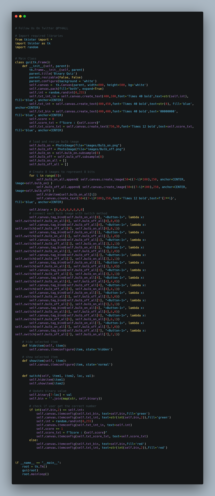
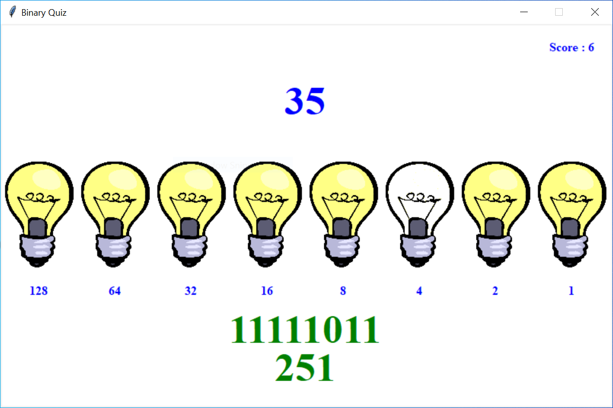

# Binary_Quiz
Python Script Binary Quiz Game



## This is Binary Quiz Game.

#### The modules Used to make this script are:-

        -tkinter
        -random

This is a GUI based python script.

## Install
```
- Download this repository on local machine.
- Extract Binary_Quiz repository on local machine and open Binary_Quiz folder
- Open/Run main_gui.py with python 

```

Python Code On windows machine:

clone Binary_Quiz repository on local machine.
```

> git clone https://github.com/geosaleh/Binary_Quiz

```
change directory to SudokuSolver
```

> cd Binary_Quiz/

```

Now its time to execute **main_gui.py**
```

> python main_gui.py

```
it will show following Output


## Download
:paperclip: [Download Here](https://github.com/geosaleh/Binary_Quiz/archive/refs/heads/main.zip)

Hope you'll install it in your computer just to try .


```
